| Icon Name      | Icon Image                                            |
| -------------- | ----------------------------------------------------- |
| `angularjs`    |     |
| `aws`          |           |
| `azure`        |         |
| `babel`        |         |
| `blender`      |       |
| `bootstrap`    |     |
| `c`            |             |
| `clion`        | 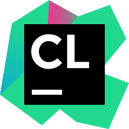        |
| `cpp`          | 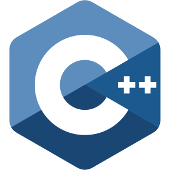    |
| `csharp`       |        |
| `css3`         |          |
| `dart`         | 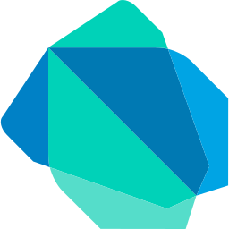         |
| `django`       |        |
| `docker`       | 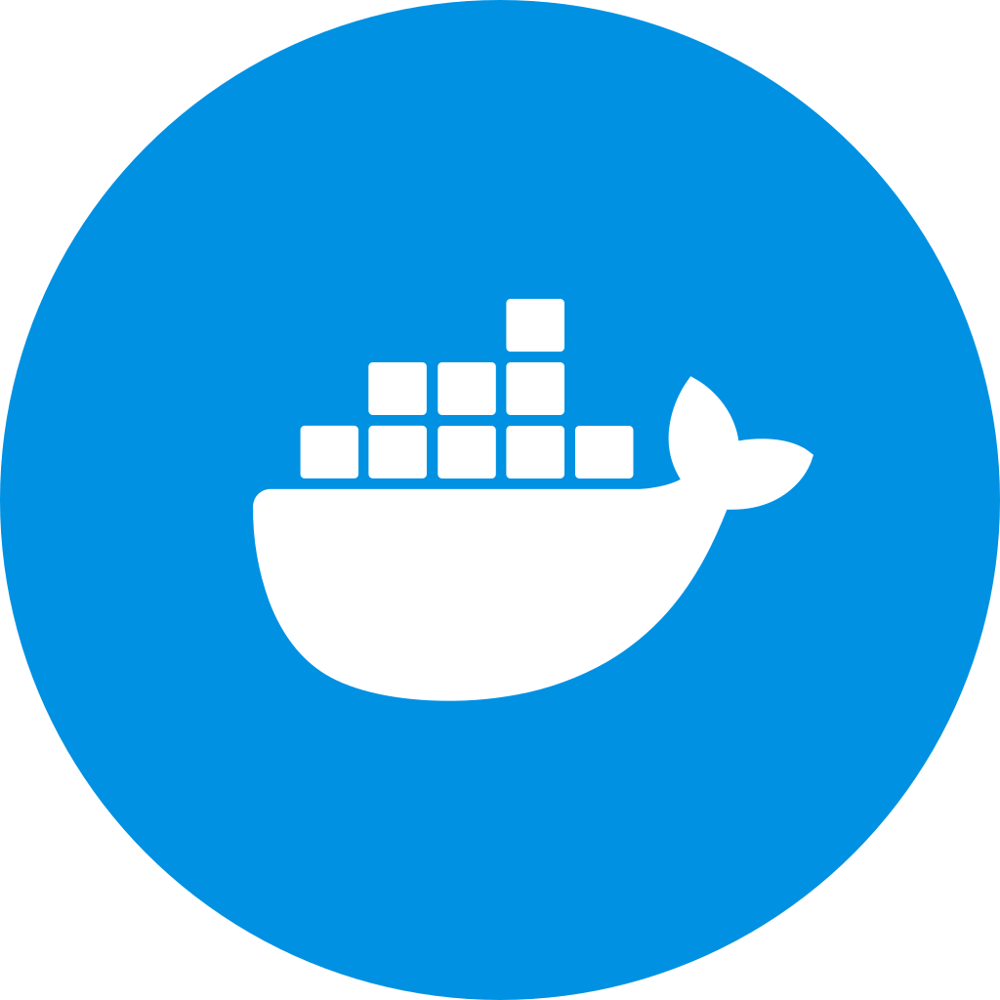       |
| `dotnet`       |        |
| `electron`     |      |
| `expressDark`  |      |
| `expressLight` |    |
| `figma`        |         |
| `firebase`     |      |
| `flask`        |         |
| `flutter`      |       |
| `gatsby`       |        |
| `git`          |           |
| `github`       |        |
| `go`           |            |
| `graphql`      | 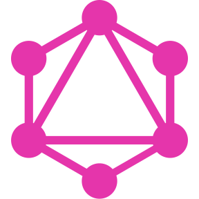      |
| `haskell`      |       |
| `html5`        |         |
| `intellij`     |      |
| `java`         |          |
| `javascript`   |    |
| `jenkins`      |       |
| `jest`         |          |
| `jira`         |          |
| `jquery`       |        |
| `julia`        |         |
| `jupyter`      |       |
| `kotlin`       |        |
| `less`         |          |
| `linux`        |         |
| `markdown`     |      |
| `matlab`       |        |
| `mocha`        |         |
| `mongodb`      |       |
| `mysql`        |         |
| `nextjs`       |        |
| `nodejs`       | 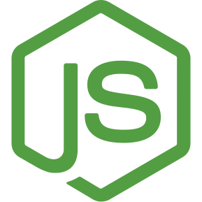       |
| `numpy`        |         |
| `nuxtjs`       |        |
| `opencv`       | 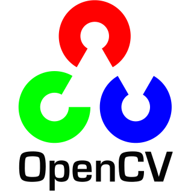       |
| `perl`         |          |
| `php`          |           |
| `postcss`      |       |
| `postgresql`   |    |
| `postman`      |       |
| `prettier`     | 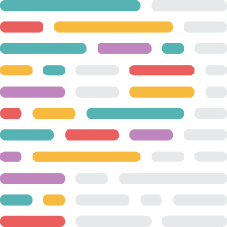     |
| `prisma`       |        |
| `pycharm`      | 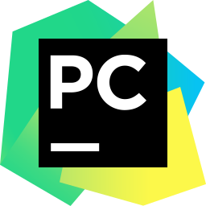      |
| `python`       |        |
| `pytorch`      |       |
| `r`            |             |
| `reactjs`      |       |
| `reactrouter`  |   |
| `redux`        |         |
| `ruby`         |          |
| `rust`         |          |
| `sass`         |          |
| `scala`        |         |
| `sketch`       |        |
| `sqlite`       |        |
| `svelte`       |        |
| `swift`        |         |
| `tailwindcss`  |   |
| `tensorflow`   | 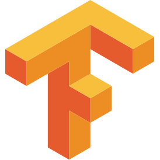   |
| `threejsDark`  |      |
| `threejsLight` |    |
| `typescript`   |    |
| `unity`        |         |
| `unrealengine` |  |
| `vscode`       |        |
| `vuejs`        |         |
| `webstorm`     | 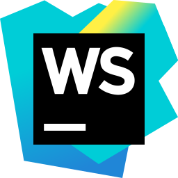     |
